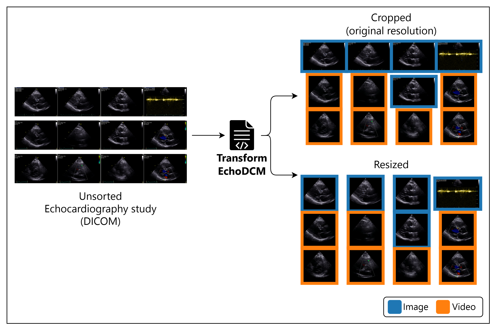

# Transform EchoDCM



## Requirements

- Python 3.11
- `opencv-python`
- `scikit-image`
- `pandas`
- `sympy`
- `numpy`
- `pydicom`
- `matplotlib`
- `tqdm`

Install the required Python libraries with:

```bash
pip install opencv-python scikit-image pandas sympy numpy pydicom matplotlib tqdm
```

## How to use

1. Open `main_process.py` and configure the input and output paths at the bottom of the file:

   ```python
   root_folder = r'/path_to_your_input_dicom_files/'
   root_out_folder = r'/path_to_output_your_transformed_files/'
   ```

2. Run the preprocessing script:

   ```bash
   python main_process.py
   ```

The input path must contain the DICOM files, but they do not need to be located directly in the root folder. The script recursively walks through `root_folder` and its child directories to find folders containing DICOM files. The output path will contain the mirrored folder structure under `vids_cropped` and `vids_resized`.

The number of workers and batch size can optionally be configured through the `PREPROCESS_DCM_WORKERS` and `PREPROCESS_DCM_BATCH_SIZE` environment variables.

This project processes ultrasound DICOM files through two paths:

## Input type

- **Video:** A multi-frame DICOM is saved as a AVI video.
- **Image:** A single-frame DICOM is saved as a PNG image.

## Output type

Each input produces two types of output:

### Cropped (`vids_cropped`)

- **Images:** The PNG is always saved unchanged at its original resolution. This includes 2D ultrasound, M-Mode, spectral Doppler, waveform, graphics, and images without ultrasound-region metadata.
- **Videos with a detected cone:** The AVI keeps the area bounded by the ultrasound cone at its calculated crop resolution.
- **Videos without a valid cone:** Each frame is center-cropped to a square before it is written.

### Resized (`vids_resized`)

- **2D images with a detected cone:** The cone mask is applied, the image is cropped around the cone, and the result is resized to 256 x 256 pixels. The image is saved as a PNG.
- **M-Mode, spectral Doppler, waveform, graphics, images without region metadata, or 2D images where cone detection fails:** The aspect ratio is preserved and the shortest side is resized to 256 pixels. The other side is scaled proportionally. The image is saved as a PNG.
- **Videos with a detected cone:** Every frame is masked and cropped around the cone, then resized to 256 x 256 pixels and saved as an AVI.
- **Videos without a valid cone:** Every frame is center-cropped to a square and resized to 256 x 256 pixels before being saved as an AVI.

## Consideration

- The script can be relaunched after a failure or interruption. It detects output files that have already been created and skips them, allowing processing to continue without starting again from the beginning.

## Contact

For any questions or inquiries, feel free to reach out to Pere Lopez-Gutierrez, Vall d'Hebron Institut de Recerca, Barcelona, Spain: [pere.lopez@vhir.org](mailto:pere.lopez@vhir.org).
